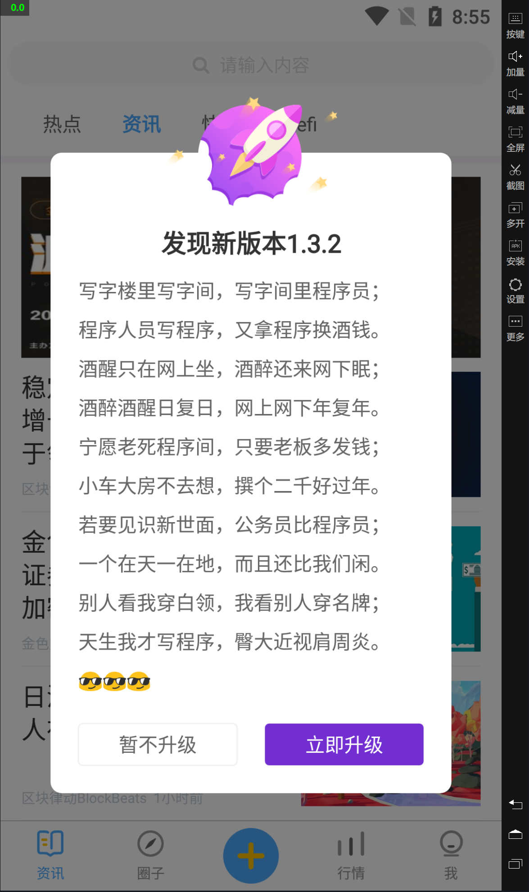

# uni-pushy-client

## 简介

**Uni-pushy** 的客户端 sdk。零依赖实现 uni-app 的热更新。非常容易集成。后续开放自定义处理更新逻辑~

热更新适用于 uni-app 开发的 Android，Ios 端应用。支持 nvue， 如果不改动原生配置可以一直用热更新更新。



## 快速上手

### **安装**

在你的 uni-app 项目根目录下执行：

```bash
npm i @limm/uni-pushy-client
```

### **使用**

`${app/src/utils/pushy/index.js}`

```javascript
import Pushy from '@limm/uni-pushy-client'

export default new Pushy({
  // 项目id
  projectId: 'c187ac54ddcdef8fdba2558c30da62e5',
  // 更新地址
  updateUrl: 'https://api.uni-pushy.yoouu.cn',
  // 主题色
  mainColor: '722ed1',
  // logo
  logo: '/static/images/update/ic_ar.png',
  // 是否打开检查更新
  update: true,
})
```

**constructor(options)**

- `projectId` <String> `uni-pushy-admin` 创建的项目 `id` 默认: `''`
- `updateUrl` <String> `uni-pushy-server` 部署可访问的地址 默认: `''`
- `mainColor` <String> 主题色 默认: `'FF5B78'`
- `logo` <String> 弹窗图标 url `/` 相当于**项目根目录**（**cli** 创建的项目为 **src**） 默认: `''`
- `update` <Boolean> 是否打开检查更新 默认：`true`
- 返回：更新对象

## Api

### **检查更新 - getUpdate(manual)**

**该方法通过按钮点击调用需要做防抖处理！**

- `manual` <Boolean | null> 是否手动触发

```javascript
const res = await pushy.getUpdate()
```

**pushy.getUpdate() : Promise<result>**

该方法只会 **resolve**，参数为包装过后的结果对象

- `statusCode` <Number> 状态码，执行该方法之后的结果主要根据状态码进行判断
  - `251` 需要更新原生版本 附带 `data`、`response`
  - `252` 需要更新 wgt 版本 附带：`message`、`data`、 `response`
  - `253` 暂无更新 附带：`message`、`response`
  - `254` 请求成功，但接口响应返回失败 附带： `message`， `response`
  - `451` 更新被关闭，用户手动配置关闭了 附带： `message`
  - `452` 用户未配置更新地址 附带： `message`
  - `453` 无项目 ID 或项目 ID 不正确 附带： `message`
  - `473` 正在检查更新 附带： `message`
  - `474` 正在静默更新 附带： `message`
  - `475` 已经更新完成，需要重启 App 生效 附带： `message`
  - `476` 正在更新中... 附带：`message`
  - `500` 请求失败 附带： `message`、`error`
  - `505` 未知错误
- `message` <String> 信息描述
- `data` <Object> native 或者 wgt 包信息
- `response` <Object> 原生响应对象
- `error` <Error> 原生错误对象

### **获取信息 - getInfo()**

```javascript
const res = await pushy.getInfo()
```

**pushy.getInfo() : Promise<result>**

该方法只会 **resolve**，返回属性

```javascript
const res = {
  //
  appid: '__UNI__70FC0DB',
  // 原生（基座） 版本名
  nativeVersion: '1.3.0',
  // 原生（基座） 版本号
  nativeVersionCode: 130,
  // wgt 版本名
  wgtVersion: '1.3.0',
  // wgt 版本号
  wgtVersionCode: 130,
  // uni.getSystemInfoSync() 返回一致
  systemInfo: {
    errMsg: 'getSystemInfoSync:ok',
    brand: 'OPPO',
    model: 'PCLM10',
    pixelRatio: 3,
    screenWidth: 360,
    screenHeight: 640,
    windowWidth: 360,
    windowHeight: 640,
    statusBarHeight: 24,
    language: 'zh-CN',
    system: '7.1.2',
    version: '1.9.9.80492',
    fontSizeSetting: '',
    platform: 'android',
    SDKVersion: '',
    windowTop: 0,
    windowBottom: 0,
    safeArea: {
      left: 0,
      right: 360,
      top: 24,
      bottom: 640,
      width: 360,
      height: 616,
    },
    safeAreaInsets: {
      top: 24,
      right: 0,
      bottom: 0,
      left: 0,
    },
    uuid: '865166023573440',
  },
  // 个人配置
  _config: {
    projectId: '',
    update: true,
    updateUrl: 'http://10.0.0.3:8081',
    log: false,
    mainColor: '722ed1',
    logo: '/static/images/update/ic_ar.png',
  },
  // 生效的配置
  _workSetting: {
    updateUrl: 'http://10.0.0.3:8081',
    log: false,
    mainColor: '722ed1',
    logo: '/static/images/update/ic_ar.png',
  },
}
```

## 最佳实践

全局只创建一个 `Pushy` 对象，之后 App 的更新都使用该对象来完成。例如我们的项目：

`${app/src/utils/pushy/index`

```javascript
import config from '@/config/index'
import Pushy from '@limm/uni-pushy-client'

export default new Pushy({
  // 项目id
  projectId: config.get('UPDATE_PROJECT_ID'),
  // 更新地址
  updateUrl: config.get('UPDATE_BASE_API'),
  // 是否打开log
  log: config.get('UPDATE_DEBUG'),
  // 主题色
  mainColor: '722ed1',
  // logo
  logo: '/static/images/update/ic_ar.png',
})
```

在 `App.vue` 的 `onLaunch` 中检查更新一次即可。就是这么简单。

`${app/src/App.vue`

```javascript
// #ifdef APP-PLUS
import pushy from '@/utils/pushy/index'
// #endif

export default {
  onLaunch: function () {
    console.log('App Launch')
    // #ifdef APP-PLUS
    // 锁定屏幕
    plus.screen.lockOrientation('portrait-primary')
    // 检查更新
    pushy.getUpdate()
    // #endif
  },

  onShow: function () {
    console.log('App Show')
  },

  onHide: function () {
    console.log('App Hide')
  },
}
```

如果有更新就会弹出更新框了，当然这是后台配置的。


### 原生包

首先基于现在的版本打包，选择发行 > 原生 app - 云打包 > 选择你需要的平台，打出一个原生包。打包完成上传至 uni-pushy 后台管理。

### 热更新包

修改 `manifest.json` 的应用版本名称，和应用版本号（版本号只能前进，相对应的版本名也需要），增加版本号，选择发行 > 原生 app - 制作应用 wgt 包 > 打出资源包，上传至 uni-pushy 后台管理。

**wgt 资源一定依赖某个原生资源！**

## 发布订阅

wip

## Todo

- 基于发布订阅的事件更新机制，用户可以随意定制界面
- 国际化支持
- 清除更新的缓存

## 示例项目

## 更新类型

**静默更新**

用户无感知，自动在后台下载更新安装，下次启动 app 显示新版本。

**强制更新**

用户感知，打开 app，或者检查更新直接下载安装，安装完成后提示用户，软重启之后生效。

**普通更新**

用户感知，打开 app，或者检查更新需要用户同意更新后，下载更新自动安装，安装完成后提示用户，软重启之后生效。
